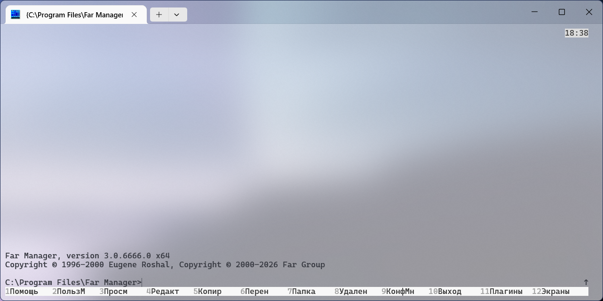

# theming-far

A modern approach to making themes for **Far Manager** — the
reverse-engineered format, the install procedure, the acrylic-blur trick
for Windows Terminal, and a couple of working themes to use as-is or
fork.

🇺🇸 [English](#english) · 🇷🇺 [Русский](#русский)



---

## English

### Why this exists

Far Manager has a "Themes" menu with built-in options, but the stock
themes (`GreenMile`, `VaxColors`, `dn_like`, ...) date back to the
Norton-Commander era — bright colors on dark backgrounds, palette index
mode, designed for CGA monitors. Modern Far (3.0 build 5400+) supports
24-bit truecolor and runs comfortably inside Windows Terminal with
acrylic blur, but there's no canonical guide to making themes that take
advantage of either.

This repo is what I learned by reverse-engineering the format and
building two production-ready theme families.

### What's inside

| Path | What |
|---|---|
| [themes/farlight-2026/](themes/farlight-2026/) | Light theme inspired by VS Code Light Modern (2026). Three variants: solid, command-line acrylic, full acrylic. |
| [themes/fardark-2026/](themes/fardark-2026/) | Dark theme inspired by VS Code Dark Modern (2026). Same three variants. |
| [docs/01-format.md](docs/01-format.md) | The `.farconfig` XML format, flags, palette indices, the `0x80` scheme-default sentinel. |
| [docs/02-install.md](docs/02-install.md) | How to install a theme on Far 3.0.6666. The triplet, Program Files, the GUI-only import. |
| [docs/03-palette-design.md](docs/03-palette-design.md) | How to design a palette and map it onto Far's 162 color keys. |
| [docs/04-acrylic-trick.md](docs/04-acrylic-trick.md) | How to make Windows Terminal acrylic blur through Far surfaces. |
| [docs/05-troubleshooting.md](docs/05-troubleshooting.md) | What to check when something doesn't apply, doesn't appear, or looks wrong. |
| [reference/far-3.0.6666-keys.txt](reference/far-3.0.6666-keys.txt) | All 162 color keys, grouped, with a description per group. |
| [reference/theme-skeleton.farconfig](reference/theme-skeleton.farconfig) | Empty theme template with all 162 keys preset to white-on-black. Start here when authoring. |
| [scripts/Install-AllThemes.ps1](scripts/Install-AllThemes.ps1) | **Recommended.** Detects Far, auto-elevates, installs every bundled theme + highlighting in one shot. Pick from Far's Themes menu afterwards. |
| [scripts/install-theme.ps1](scripts/install-theme.ps1) | Install a single specific theme. Useful for testing one variant. Auto-detects matching highlighting. |
| [scripts/backup-colors.ps1](scripts/backup-colors.ps1) | Export current Far config (colors + everything) before you change anything. |
| [scripts/diff-themes.ps1](scripts/diff-themes.ps1) | Diff two `.farconfig` files by color key. Useful when authoring variants. |
| [scripts/audit-contrast.ps1](scripts/audit-contrast.ps1) | Check a theme for low-contrast cells (WCAG-style). Excludes by-design exemptions. |
| [AGENTS.md](AGENTS.md) | Brief for an LLM agent asked to author or extend themes here. |

### Install one of the bundled themes

> ⚠️ Tested on Far Manager 3.0.6666 x64 (Windows). Earlier 3.x builds
> should work; YMMV.

1. **Back up your current config** (so you can roll back):
   ```powershell
   .\scripts\backup-colors.ps1
   ```
2. **Install everything in one shot.** From a normal (unelevated) PowerShell
   in the repo root:
   ```powershell
   .\scripts\Install-AllThemes.ps1
   ```
   The script auto-detects Far's install location (registry), requests UAC
   once, then copies all six interface variants and matching file-coloring
   rules into `Program Files\Far Manager\Addons\Colors\`. Themes are passive
   — installing all six is cheap; you pick the active one in Far's menu.
3. **Restart Far**, then `F9 → Options → Colors → Themes → <pick the theme>`.
   Far will ask which sections to apply — if you want only the interface
   palette and not the file-panel coloring, untick **Default Highlighting**.

### Make your own theme

Read `docs/03-palette-design.md`, copy `reference/theme-skeleton.farconfig`,
fill in your colors. The whole process is ~1 hour for someone who knows
their palette already.

### License

MIT. See [LICENSE](LICENSE).

---

## Русский

### Зачем это

В Far Manager есть меню «Темы» со встроенными вариантами, но штатные
темы (`GreenMile`, `VaxColors`, `dn_like` и так далее) — это эпоха
Norton Commander: яркие цвета на тёмном фоне, индексная палитра,
CGA-эстетика. Современный Far (3.0 build 5400+) умеет 24-битный
truecolor и уютно живёт в Windows Terminal с acrylic blur, но
канонического руководства о том, как делать темы, которые этим
пользуются, нет.

Этот репозиторий — то, что я выяснил, ковыряя формат и делая две
готовых к продакшну семейства тем (Light и Dark, по три варианта в каждом).

### Что внутри

| Папка/файл | Что |
|---|---|
| [themes/farlight-2026/](themes/farlight-2026/) | Светлая тема в духе VS Code Light Modern (2026). Три варианта: обычная, command-line acrylic, full acrylic. |
| [themes/fardark-2026/](themes/fardark-2026/) | Тёмная тема в духе VS Code Dark Modern (2026). Те же три варианта. |
| [docs/01-format.md](docs/01-format.md) | Формат `.farconfig` XML, флаги, индексы палитры, `0x80` sentinel «scheme default». |
| [docs/02-install.md](docs/02-install.md) | Установка темы в Far 3.0.6666. Что обязательно, что опционально, GUI-only импорт. |
| [docs/03-palette-design.md](docs/03-palette-design.md) | Как спроектировать палитру и разложить её по 162 цветовым ключам Far'а. |
| [docs/04-acrylic-trick.md](docs/04-acrylic-trick.md) | Как сделать так, чтобы acrylic blur Windows Terminal был виден сквозь поверхности Far'а. |
| [docs/05-troubleshooting.md](docs/05-troubleshooting.md) | Что проверять, когда что-то не применилось, не появилось или выглядит не так. |
| [reference/far-3.0.6666-keys.txt](reference/far-3.0.6666-keys.txt) | Все 162 цветовых ключа, сгруппированные с описанием каждой группы. |
| [reference/theme-skeleton.farconfig](reference/theme-skeleton.farconfig) | Пустой шаблон темы — все 162 ключа preset на белом-на-чёрном. С него начинай. |
| [scripts/Install-AllThemes.ps1](scripts/Install-AllThemes.ps1) | **Рекомендуется.** Находит Far, поднимает права через UAC, ставит сразу все темы + highlighting'и одним проходом. Дальше выбираешь нужную в меню Far'а. |
| [scripts/install-theme.ps1](scripts/install-theme.ps1) | Установка одной конкретной темы — для точечных тестов варианта. Подцепляет соседний highlighting. |
| [scripts/backup-colors.ps1](scripts/backup-colors.ps1) | Экспорт текущего конфига Far'а (цвета и остальное) перед любыми изменениями. |
| [scripts/diff-themes.ps1](scripts/diff-themes.ps1) | Diff двух `.farconfig` по ключам. Полезно при разработке вариантов темы. |
| [scripts/audit-contrast.ps1](scripts/audit-contrast.ps1) | Проверка темы на низкоконтрастные ячейки (по WCAG). Учитывает by-design исключения. |
| [AGENTS.md](AGENTS.md) | Бриф для LLM-агента, которого попросили создать или расширить темы здесь. |

### Установить одну из тем

> ⚠️ Тестировалось на Far Manager 3.0.6666 x64 (Windows). Более ранние
> 3.x билды должны работать; гарантий нет.

1. **Сделай бэкап текущего конфига** (чтобы было куда откатываться):
   ```powershell
   .\scripts\backup-colors.ps1
   ```
2. **Установи все темы одной командой.** Из обычного (не-elevated) PowerShell
   в корне репо:
   ```powershell
   .\scripts\Install-AllThemes.ps1
   ```
   Скрипт сам найдёт где установлен Far (через реестр), один раз запросит UAC,
   потом разложит все 6 интерфейсных вариантов и соответствующие
   highlighting'и в `Program Files\Far Manager\Addons\Colors\`. Темы пассивны —
   ставить все 6 ничего не стоит; активную выберешь в меню Far'а.
3. **Перезапусти Far**, дальше `F9 → Параметры → Цвета → Темы → <выбери тему>`.
   Far спросит, какие секции применять — если нужна только палитра интерфейса
   без обновления раскраски файлов, сними галочку **Default Highlighting**.

### Сделать свою тему

Прочитай `docs/03-palette-design.md`, скопируй
`reference/theme-skeleton.farconfig`, заполни своими цветами. Весь
процесс — около часа, если палитра у тебя уже есть.

### Лицензия

MIT. См. [LICENSE](LICENSE).

---

## Acknowledgments / Благодарности

- The Far Manager team (Eugene Roshal et al) — for keeping orthodox file
  managers alive on Windows. Команда Far Manager — за то, что не дали
  ортодоксальным файловым менеджерам умереть на Windows.
- VS Code's Light Modern palette — the colour reference behind the
  shipped themes. Палитра VS Code Light Modern — цветовой референс
  поставляемых тем.
- This repo started as a one-off pet project; it grew into a guide once
  it became clear nobody else had written one down. Этот репозиторий
  начался как одноразовый пет-проект и вырос в гайд, когда стало ясно,
  что никто другой ничего такого не записал.
