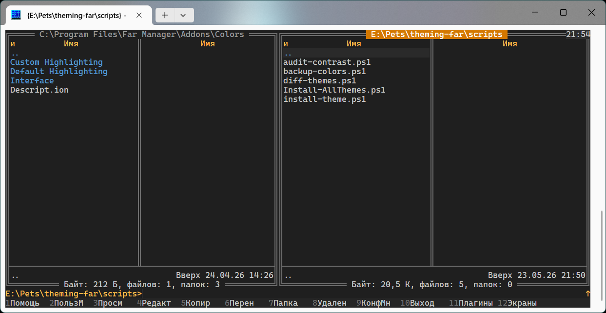
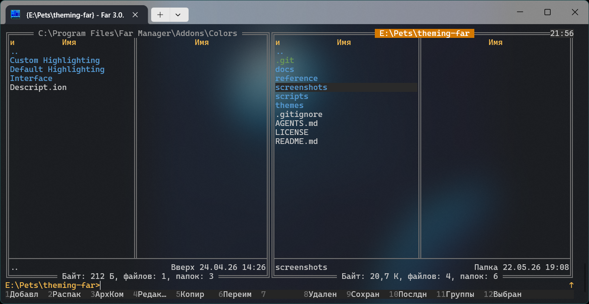

# FarDark 2026

A dark theme for Far Manager inspired by **VS Code Dark Modern** (2026).
Three variants ship together:

- **`FarDark2026.farconfig`** — strict dark theme, all-solid surfaces,
  truecolor RGB everywhere. Looks the same regardless of Windows Terminal settings.
- **`FarDark2026Acrylic.farconfig`** — same theme, but with the command line and
  Ctrl-O user screen passing through Windows Terminal's acrylic blur.
- **`FarDark2026FullAcrylic.farconfig`** — every "editor background" surface
  (Panel, Editor, Viewer, Menu, Dialog, Help) is acrylic-transparent. Most
  immersive of the three; needs a Dark WinTerm scheme to stay readable.

See [docs/04-acrylic-trick.md](../../docs/04-acrylic-trick.md) for how the
acrylic variants work.

A `Highlighting.farconfig` is bundled for file-panel coloring under
Dark, and `Colorer.hrd` ports VS Code Dark Modern's syntax palette to
the F4 editor (via the FarColorer plugin). The install script handles
both; activate the editor syntax via
`F11 → FarColorer → Settings → Main settings`, tick **`[x] TrueMod
Enable`** and pick **FarDark2026 (theming-far)** in the **TrueMod
color style** dropdown.
See [docs/06-colorer-schemes.md](../../docs/06-colorer-schemes.md).

## Preview

## Palette

| Role | Hex | Where it shows |
|---|---|---|
| Background (editor/panel) | `#1F1F1F` | Editor, Panel, Menu, Dialog list |
| Secondary surface | `#252525` | Keybar |
| Title bar / HMenu | `#2D2D2D` | Top menu, clock |
| Text | `#CCCCCC` | Primary text everywhere |
| Subtle / hint | `#9D9D9D` | Labels, Panel.Info, dialog titles |
| Disabled | `#6E6E6E` | Grayed out items |
| Accent / hotkey / link | `#0078D4` | Hotkey letters, Help.Topic, Editor.Status |
| Active list selection | `#04395E` + `#CCCCCC` | Menu / Dialog list selection |
| Editor selection | `#264F78` | Editor.Text.Selected, Dialog.Edit.Selected |
| Hover / cursor row | `#2A2A2A` | Panel cursor (current file) |
| Border / scrollbar | `#454545` | Panel.Box, scrollbars |
| Warning background | `#5A1D1D` | WarnDialog |
| Marked file accent | `#FF8484` | Files selected with `Insert` |
| Highlight (yellow) | `#DCDCAA` | WarnDialog hotkey |

The colors come from VS Code Dark Modern with minor adjustments for terminal
contrast (e.g. directories use the brighter `#4FC1FF` rather than the regular
accent `#0078D4` so they pop on the panel).

## Install

See top-level [README](../../README.md#install) for the install procedure.
