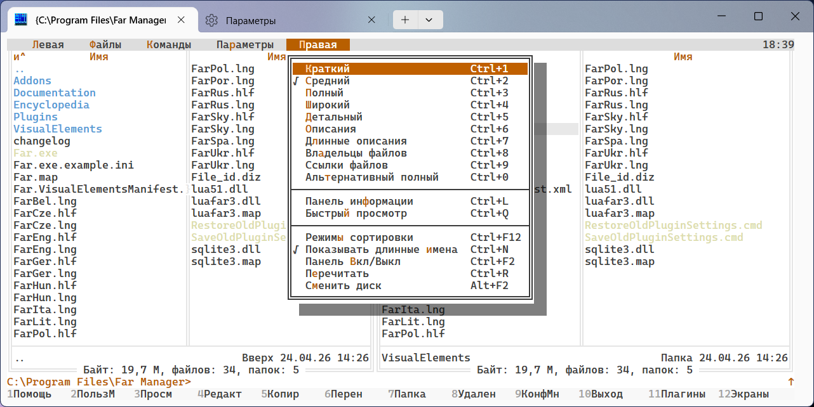

# FarLight 2026

A light theme for Far Manager inspired by **VS Code Light Modern** (2026).
Three variants ship together:

- **`FarLight2026.farconfig`** — strict light theme, all-white solid surfaces,
  truecolor RGB everywhere. Looks the same regardless of Windows Terminal settings.
- **`FarLight2026Acrylic.farconfig`** — same theme, but with the command line
  and Ctrl-O user screen painted in Windows Terminal's scheme-default background,
  which WinTerm renders with acrylic blur.
- **`FarLight2026FullAcrylic.farconfig`** — every "white" surface (Panel,
  Editor, Viewer, Menu, Dialog, Help) is acrylic-transparent. Accent colors
  (selection, status bar, warn dialog) stay solid for visual anchoring.

See [docs/04-acrylic-trick.md](../../docs/04-acrylic-trick.md) for how the
acrylic variants work.

A `Highlighting.farconfig` is also bundled — file-panel coloring rules
(directories blue, executables green, etc.) tuned for the Light palette.
The install script auto-applies it; pass `-NoHighlighting` to skip.

## Preview

## Palette

| Role | Hex | Where it shows |
|---|---|---|
| Background (editor/panel) | `#FFFFFF` | Editor, Panel, Menu, Dialog list |
| Text | `#3B3B3B` | Primary text everywhere |
| Subtle / hint | `#616161` | Labels, Panel.Info, dialog titles |
| Disabled | `#A0A0A0` | Grayed out items |
| Accent / hotkey / link | `#005FB8` | Hotkey letters, Help.Topic, Editor.Status |
| Active list selection | `#0060C0` + white | Menu / Dialog list selection |
| Editor selection | `#ADD6FF` | Editor.Text.Selected, Dialog.Edit.Selected |
| Hover / cursor row | `#E8E8E8` | Panel cursor (current file) |
| Border / scrollbar | `#E5E5E5` | Panel.Box, scrollbars |
| Title bar / HMenu | `#DDDDDD` | Top menu, clock |
| Warning background | `#A1260D` | WarnDialog (e.g. "Delete file?") |
| Marked file accent | `#A1260D` | Files selected with `Insert` |
| Highlight (yellow) | `#FFE082` | WarnDialog hotkey |

## Design notes

- **Marked files are red, not yellow.** Classic Far themes use bright yellow for
  files selected with Insert, but yellow on white background is unreadable. Reusing
  the warning red `#A1260D` doubles as a single "important/dangerous" cue.
- **List selection is `#0060C0`, slightly darker than the `#005FB8` accent.** This
  keeps white text on selected items above WCAG AA contrast.
- **`CustomColor0..15` are populated.** Some macros and plugins (LF, NetBox,
  Colorer) reach for these. Setting them to palette values prevents stray bright
  colors leaking from a previous theme.

## Install

See top-level [README](../../README.md#install) for the install procedure
(triplet of files into `Addons\Colors\`).
